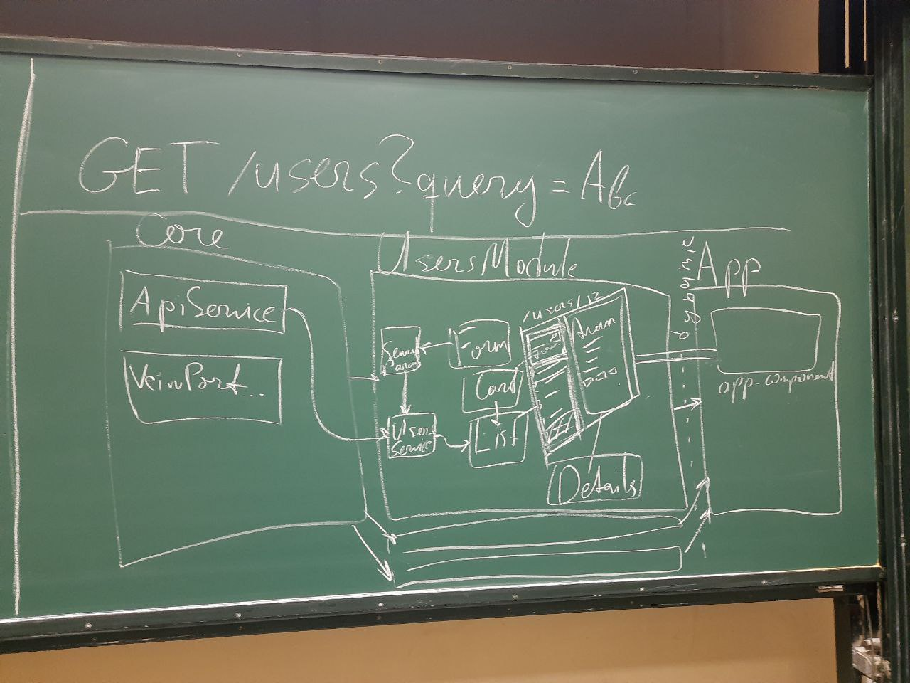

# 2021-12-14 Практикум по Ангуляр

Этот репозиторий содержит материалы к вебинару по Angular](https://drive.google.com/file/d/1DsWcoqKf0E6ZOYhz4zJjWgMWivZpwXcm/view) от [Соловьева Сергея](http://sergsol.com/).
Для лучшего понимания предварительно стоит изучить [материалы лекции по TS/RxJS/Angular](https://docs.google.com/presentation/d/19vLBbqguHKvquEDZYMTC5Cf-sZvf8GtY/edit#slide=id.p29)

# Задача

Дано [готовое API](https://www.notion.so/2021-12-14-6381f4ee9e81463c9a82ba32f19fa6db) для получения и фильтрации списка пользователей.

Требуется разработать приложение, которое позволит:

- просматривать список пользователей
- осуществлять регистронезависимый поиск по списку пользователей
- отображать подробную информацию о пользователях

Приложение необходимо реализовать с использованием фреймворка Angular (компонентый подход, DI, RxJS)

# План работы

1. Изучить требования к реализуемому приложению
2. Заскаффолдить приложение
3. Подключить зависимости (библиотеки)
4. Сгенерировать модули, компоненты и сервисы
5. Написать код приложения
6. Залить код на GitHub

# Используемое API

Список пользователей

[](https://sdal.pw/api/cdc/users)

## Параметры запроса

`query: string` — регулярное выражение, [поддерживаемое движком MongoDB](https://docs.mongodb.com/manual/reference/operator/query/regex/) для фильтрации по имени пользователя

`id: number` — фильтрация по числовому идентификатору пользователя

# Структура приложения



<details>
  <summary>
    Структура приложения в виде списка
  </summary>
  ```md
  1. core.module
      1. services
          1. api.service
          2. viewport.service
      2. models
          1. user.model
          2. users-search-params.model
      3. utils
  2. users.module
      1. services
          1. users.service
          2. users-search-params.service
      2. components
          1. users-page.component
          2. users-list.component
          3. users-search.component
          4. user-details.component
  3. app.module
      1. components
          1. app.component
  ```
</details>

# Генерация приложения

Заскаффолдим базовую структуру приложения

```bash
# Если глобально установлен ангуляр
ng new --prefix=qoollo --style=scss --routing --strict qoollo-users-list

# Если ангуляр не установлен или нужна конкретная версия
npx --package @angular/cli@13.1.1 ng new --prefix=qoollo --style=scss --routing --strict qoollo-users-list
```

Добавим в `tsconfig.json` синтетические импорты

```json
{
  //...
  "compilerOptions": {
    //...
    "allowSyntheticDefaultImports": true
  }
}
```

Установим зависимости

```bash
# Установим бибилотеку lodash
npm i lodash
# и декларации типов к ней
npm i -D @types/lodash

# Внедрим в проект фоициальную бибилотеку компонентов Material Design
npx ng add @angular/material
```

Сгенерируем модули, сервисы и компоненты

```bash
ng g m users --route=users -m=app
ng g c users/components/users-list
ng g c users/components/user-card
ng g c users/components/users-search

ng g m core
ng g s core/services/api
ng g s core/services/viewport

# и так далее...
```

# Ссылки

Хорошее знание TypeScript сильно облегчит разработку на Angular

[The starting point for learning TypeScript](https://www.typescriptlang.org/docs/)

Официальная документация Ангуляра — лучшая точка входа, на мой взгляд.

[Angular](https://angular.io/docs)

Официальная библиотека компонентов Material Design

[Angular Material](https://material.angular.io/)

Огромное количество статей для продвинутого изучения Angular

[Angular inDepth - Community of passionate Angular engineers](https://indepth.dev/angular)

[Angular In Depth - Medium](https://medium.com/angular-in-depth)

Тут можно поиграться с кодом Ангуляра (и не только) в песочнице прям в браузере

[The online code editor for web apps. Powered by Visual Studio Code. - StackBlitz](https://stackblitz.com/)

Презентация к лекции
<iframe src="https://docs.google.com/presentation/d/e/2PACX-1vRydOIRAxzTRuFBKX-gYKl6ZhXUZrn_8EvMWmdz3EUOCgPbppR3MeERFRQu3i_qvg/embed?start=false&loop=false&delayms=60000" frameborder="0" width="1280" height="749" allowfullscreen="true" mozallowfullscreen="true" webkitallowfullscreen="true"></iframe>
